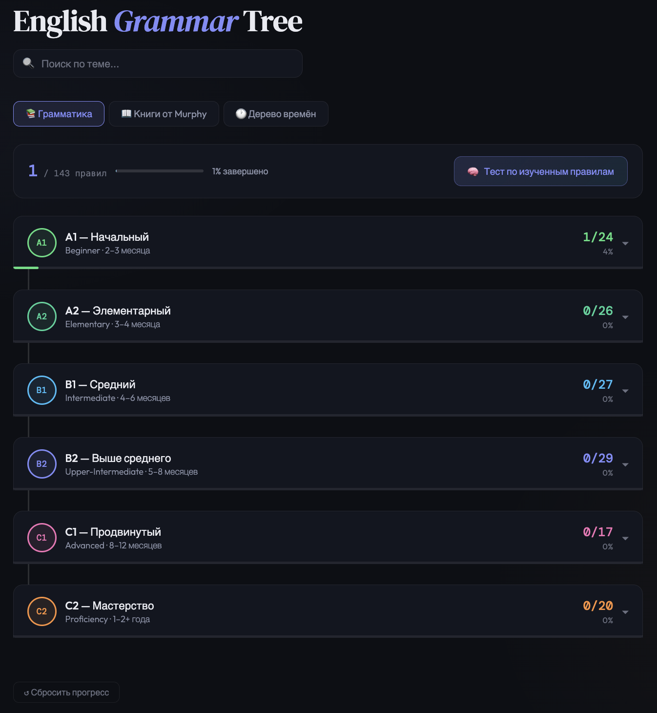
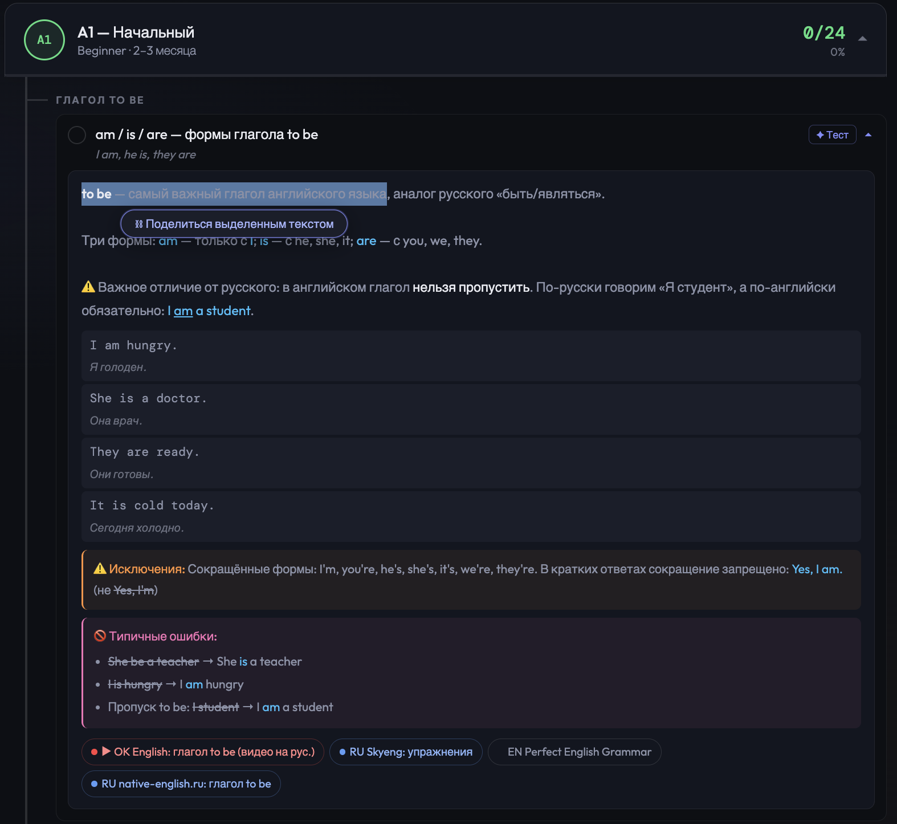
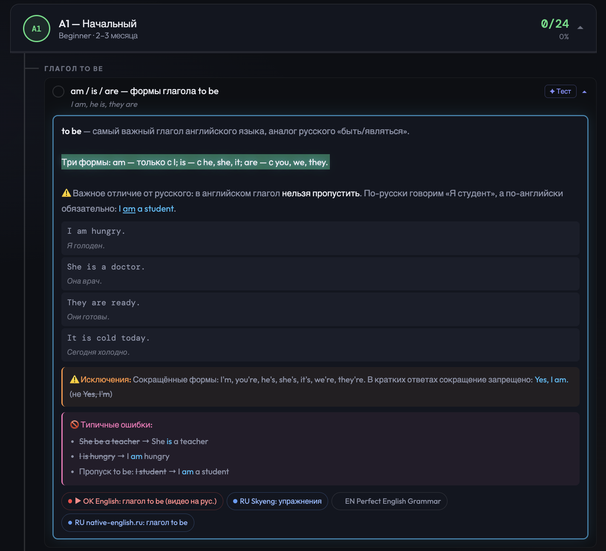

# English Grammar Tree

An interactive web application for learning English grammar rules and verb tenses, organized by proficiency level (A1–B2+). The UI is in Russian, designed for Russian-speaking English learners.

**Live:** [english-tree-garmmar.web.app](https://english-tree-garmmar.web.app)



---

## Features

### Grammar Rules
- Rules organized by CEFR levels: **A1, A2, B1, B2+**
- Each rule includes explanation, examples with translations, common mistakes, tips, and reference links (YouTube, Russian/English sources)
- Expandable cards — click a rule to read the full explanation


> The screenshot above shows the A1 level expanded with the first rule open ("am / is / are — формы глагола to be"). Each rule card contains: the rule explanation, usage examples with Russian translations, exceptions, common mistakes, and reference links (YouTube, Russian/English articles).

### Progress Tracking
- Mark rules as done/undone — saved automatically to localStorage
- Dashboard shows overall progress %, completed rule count, and completed levels
- Reset progress at any time

### Verb Tenses
- All 12 English tenses with formulas, time markers, examples, and common mistakes
- Interactive **decision tree** — answer questions to find the right tense for your sentence
- **Timeline visualization** showing how tenses relate to each other


### Search
- Full-text search across all rules (text, notes, explanations)
- Matching levels auto-expand on search

### AI Test Generation
- Generate a test prompt for any specific rule or for all completed rules
- One-click copy to clipboard — paste into ChatGPT or Claude

### Shareable Deep Links

Every grammar rule and every tense has a **share button** (⛓) that copies a direct URL to it. Opening the link scrolls straight to the rule, expands it, and highlights the card with an animated glow so it's immediately obvious what to look at.

Beyond sharing a whole rule, you can share a **specific passage** inside it:

1. Select any text inside an expanded rule or tense card.
2. A floating **"⛓ Поделиться выделенным текстом"** button appears below your selection.
3. Click it — the URL is copied to the clipboard with the exact text range encoded in the hash.



When the recipient opens the link, the app navigates to the rule, scrolls it into view, and renders the shared passage **highlighted in vivid green** with a pulsing border glow. The highlight persists until the first interaction (click, scroll, or touch), after which normal behaviour resumes.



Deep links work across all three tabs — **Grammar**, **Murphy**, and **Tenses**.

---

## Tech Stack

| Layer | Technology |
|---|---|
| Framework | React 18 + TypeScript |
| Build | Vite |
| Linting/Formatting | Biome |
| Git Hooks | Husky + lint-staged |
| Hosting | Firebase |

---

## Project Structure

```
english-grammar-tree/
├── app/
│   ├── components/
│   │   ├── Grammar/        # Grammar rules tab (levels, categories, rule cards)
│   │   ├── Tenses/         # Tenses tab (tree navigator, tense detail, timeline)
│   │   └── Header/         # Search bar and tab navigation
│   ├── data/
│   │   ├── grammar.ts      # Complete grammar database (A1–B2+)
│   │   ├── tenses.ts       # Tense definitions and examples
│   │   ├── tenseTree.ts    # Decision tree structure
│   │   └── timelineData.ts # Timeline visualization data
│   ├── hooks/
│   │   └── useProgress.ts  # Progress state (localStorage)
│   └── utils/
│       ├── clipboard.ts    # Copy to clipboard
│       ├── deepLink.ts     # Build and parse shareable deep-link URLs
│       ├── particles.ts    # Particle animation on rule completion
│       ├── prompts.ts      # AI prompt builders
│       └── selection.ts    # DOM selection helpers (encode / restore text ranges)
├── index.html
├── vite.config.ts
├── biome.json
└── firebase.json
```

---

## Getting Started

**Prerequisites:** Node.js 18+

```bash
# Install dependencies
npm install

# Start dev server
npm run dev

# Build for production
npm run build

# Deploy to Firebase
npm run deploy
```

Other scripts:

```bash
npm run lint      # Biome lint check
npm run format    # Auto-format code
npm run check     # Format + lint fix
npm run preview   # Preview production build locally
```

---

## Data Format

Grammar rules follow this structure:

```typescript
{
  id: 'a1_01',
  text: 'am / is / are — формы глагола to be',
  note: 'Short summary',
  exp: '<p>Full HTML explanation</p>',
  ex: [['I am a student.', 'Я студент.'], ...],
  exc: 'Special cases and exceptions',
  mistakes: ['Common mistake description', ...],
  links: [{ label: 'Video', url: '...', type: 'yt' | 'ru' | 'en' }],
  markers: { tags: ['...'], note: '...' }
}
```

---

## License

MIT
